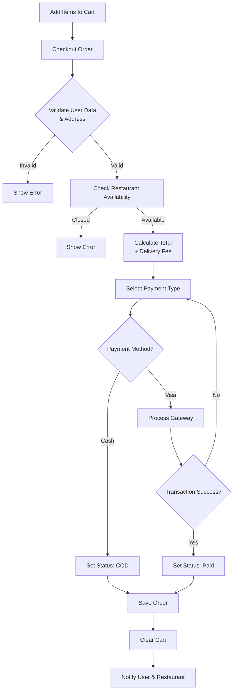
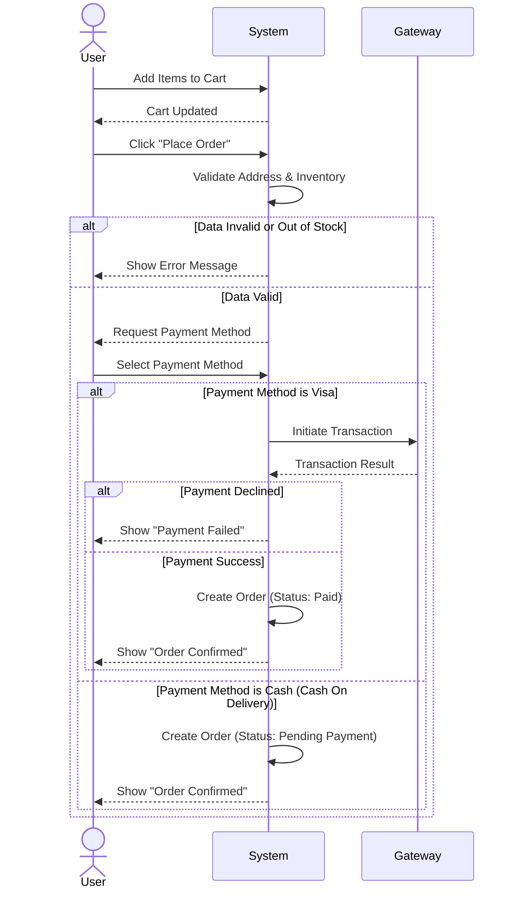
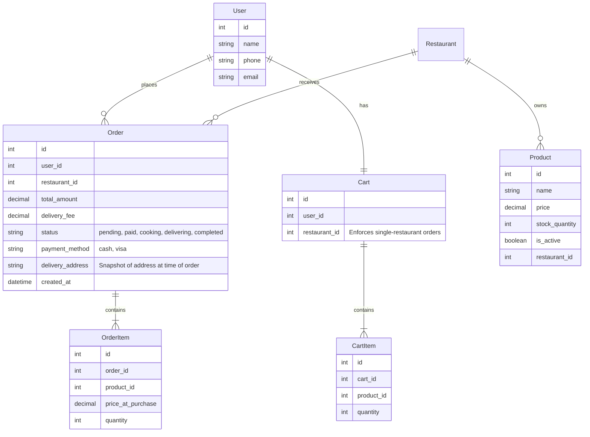

# Food Delivery System Analysis

## 1. Actor: Restaurant
**Feature: Menu Management**
*  Manage items (Create, update, delete dishes).
*  Manage item details (Prices, descriptions, images).
*  Manage availability (Mark items as in/out of stock).

**Feature: Restaurant Profile**
*  Manage restaurant information (Address, logo, name).
*  Manage settings (Opening/closing hours, preparation time).

**Feature: Business Intelligence**
*  View order analytics (Total revenue, order counts).
*  View order history (Past orders logs).

**Feature: Marketing**
*  Create and manage restaurant-specific promo codes.

---

## 2. Actor: Customer
**Feature: Authentication & Account**
*  Login and Sign up (Email, phone, social auth).
*  Manage Profile (Update name, email).
*  Address Management (Add, edit, delete delivery addresses).
*  Save Favourite Restaurants.

**Feature: Browsing Restaurants**
*  Browse restaurants (List view, categories).
*  View Restaurant Details (Menu, info).

**Feature: Cart & Ordering**
*  Add items to cart.
*  Edit cart (Update quantities, remove items).
*  Checkout (Review order, select address).
*  Place order.

**Feature: Order Tracking**
*  Track active order status (Pending, Preparing, On the way).
*  View order history.

---

## 3. Actor: Payment Gateway
**Feature: Transaction Processing**
*  Manage user payment methods.
*  Validate transaction details.
*  Approve or decline transactions.

---

## 4. Actor: System Admin
**Feature: System Marketing**
*  Create system-level promo codes.
*  Push notifications (Offers, restaurant alerts).

**Feature: Content Management**
*  Manage system categories (Define global tags like Pizza, Burgers, Sushi).
*  Vendor Approval (Verify and approve new restaurant sign-ups).

**Feature: Refund Management**
*  Refunds (Manage disputes and issue refunds).

---

## Flow Chart For "Place Order" Use Case


---

## Sequence Diagram For "Place Order" Use Case



## Pseudo Code — Place Order Use Case

```text
if (restaurant is closed OR address is out of range)
    decline

if (user data or address is invalid)
    decline

if (any item in cart is out of stock)
    decline

calculate total price

if (payment type is Visa) {
    if (transaction fails)
        fail
    else 
        mark payment as paid
} 
else {
    mark payment as cash_on_delivery
}

create order()
set order status (pending_delivery)
empty user cart
```
## Er Diagram — Place Order Use Case

---